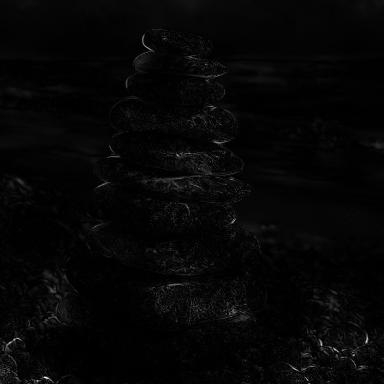
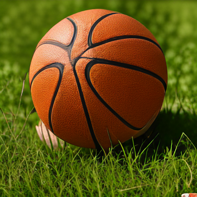

# ThinkClearly - giving Autoregressive image models the tools to copy-paste with instruction tokens

## The concept

Fine-tune AR image generating models to produce `<CLEAR>` instruction tokens when making text+image to image edits. This indicate that this token patch should be an exact pixel match to the input image


**Note: Don't use this model - its just to explore the concept of "instruction" tokens rather than pure image tokens.**


## The problem
Currently because of the way tokenizers encode images to tokens and back, there is a slight loss reconstruction loss - and you don't get a pixel perfect match between 'unedited' parts of the image even if output tokens match input tokens exactly.


<table>
  <thead>
    <tr>
      <th width="280">Original image</th>
      <th width="280">After encoding/<br/>decoding</th>
      <th width="280">Difference heatmap</th>
    </tr>
  </thead>
  <tbody>
    <tr>
      <td></td>
      <td></td>
      <td></td>
    </tr>
  </tbody>
  
</table>

This is relatively minor but is interesting for two reasons: 

   A) Sometimes you do want (relative) pixel perfect input to output matches. 

   B) The proposed solution hints AR image models that produce interesting instruction tokens in addition to image tokens.

## The solution
We fine tune [Janus-4o-7b](https://github.com/FreedomIntelligence/ShareGPT-4o-Image) Image on modified derivatives from the [magicbrush](https://huggingface.co/datasets/osunlp/MagicBrush) dataset to produce `<CLEAR>` tokens wherever output tokens match input tokens. This enables us to later copy-paste the appropriate pixels over those areas.


## Results:
### Cherrypicked successes

<table>
  <thead>
    <tr>
      <th width="280">Original image</th>
      <th width="280">Standard decoded output</th>
      <th width="280">Output + pixel copying</th>
    </tr>
  </thead>
  <tbody>
    <tr>
      <td>Make the sea shell red.</td>
      <td></td>
      <td></td>
    </tr>
    <tr>
      <td>Heatmap diff vs input</td>
      <td>MSE 400, PSNR 22</td>
      <td>MSE 319, PSNR 23</td>
    </tr>
    <tr>
      <td>Make the top rock red.</td>
      <td></td>
      <td></td>
    </tr>
    <tr>
      <td>Heatmap diff vs input</td>
      <td>MSE 139, PSNR 27</td>
      <td>MSE 52, PSNR 31</td>
    </tr>
    <tr>
      <td>Change the soccer ball to a basketball.</td>
      <td></td>
      <td></td>
    </tr>
    <tr>
      <td>Heatmap diff vs input</td>
      <td>MSE 7100, PSNR 9</td>
      <td>MSE 5229, PSNR 11</td>
    </tr>
  </tbody>
  
</table>


## Takeaways:


**Couldn't you just copy and paste pixels from the original image where input tokens match output tokens**

Yes absolutely that would have been much easier and probably much better. This was more of a conceptual exploration rather than trying to build something practically useful. Extending beyond `<CLEAR>` to other functional image tokens may provide genuinely novel benefits.


**What other useful tokens could AR image generators product**

This like enforcing symmetry, continuing patterns and applying filters to parts of the image selectively come to mind. 

Eg. "Add a chair to the middle of the image and blur the background" - indicating that parts of the image should be blurred with `<BLUR>` and applying this as a post-processing step might produce better results.


**Thoughts**
For some reason `<CLEAR>` tokens tend to be predicted in the foreground which is interesting.

I think this is very promising and leans towards tool use / instructions in AR image generation.


## Technical details

- Model base: `FreedomIntelligence/Janus-4o-7B` (ShareGPT-4o-Image), derived from DeepSeek Janus. We keep the VQ codebook/tokenizer unchanged.
- CLEAR token head: expand only the image generation head to K+1 logits (K real codes + 1 CLEAR), implemented as a lightweight wrapper that concatenates a learned CLEAR logit.
- Labels: set `<CLEAR>` wherever target token equals source token; otherwise supervise with the target token id. Dataset is JSONL with `instruction`, `input_tokens`, `output_tokens` (ints or the string "`<CLEAR>`").
- Training: LoRA on LM and base gen head; CLEAR classifier linear trained directly. Class-weighted CE with reduced weight on CLEAR to avoid collapse. Input image embeddings are inserted into a second image slot in the SFT prompt.
- Inference: generate tokens that may include CLEAR; remap CLEAR positions to source tokens before decoding; always composite pixels post‑hoc using the CLEAR mask (this is required and critical to make images look nice).
- Anti-blockiness (latent border matching & blending): at inference we smooth the 24×24 CLEAR mask in token space (latent-grid median-like filter) and feather edges in pixel space with a Gaussian blur before alpha blending. Tunables: `mask_smooth_ksize`, `mask_smooth_passes`, `feather_radius_px`.
- **Model stability: The clear weighting during training and the clear bias at inference time did not ever feel stable. Keep an eye on these. At inference time the clear bias is not sensitive but it is important. I ran out of GPU credits before I could fix this**

## How to run:

Prereqs
- Python 3.10+. A single A40 (48 GB) is sufficient for the provided defaults.

Install
```bash
# 📦 Step 1: Install Janus from source
git clone https://github.com/deepseek-ai/Janus.git
cd Janus
pip install -e .
cd ..

# 📦 Step 2: Project dependencies
pip install -r requirements.txt
```

1) Prepare dataset JSONL from MagicBrush-style samples
- Arrange samples under a directory like `/workspace/magicbrush_examples/sample_XXXX/{source.png,target.png,mask.png,metadata.json}` where `metadata.json` contains an `instruction`.
- Then run (defaults shown):
```bash
python 2_prepare_data.py  # writes /workspace/prepared_magicbrush.jsonl
```

2) Fine-tune with CLEAR head + LoRA
```bash
python 3_sft_finetune.py  # saves adapters + gen_head_clear.pt to /workspace/sft_janus4o_clear/
```

3) Run inference on a test image
- Use the callable entrypoint inside the script:
```python
from 4_simple_inference import run_clear_inference

out = run_clear_inference(
      input_image="test_0.png",
      instruction="Make the scarf blue.",
      base_model="FreedomIntelligence/Janus-4o-7B",
      finetune_dir="/workspace/sft_janus4o_clear/",
      out_dir="inference_outputs",
      use_cfg=True,
      temperature=0.8,
      cfg_weight=5.0,
      cfg_weight2=5.0,
      clear_bias=5.0,
)
```
- Outputs written: `raw_model.png`, `token_composite.png`, `pixel_composite.png`, `clear_mask.png`, plus `input_decoded.png`.
 - Notes: `pixel_composite.png` uses soft alpha blending; `clear_mask.png` is the raw mask for auditing. Set `feather_radius_px=0` to disable feathering, or `mask_smooth_ksize=1` to disable latent-grid smoothing.

4) Optional: post-inference evaluation
```bash
python 5_post_inference_eval.py  # loads images from inference_outputs and writes heatmaps/metrics
```


Practically, this fits perfectly on a A40 (48 GB VRAM)

## References:

- [Janus (DeepSeek) base model](https://github.com/deepseek-ai/Janus)
- [ShareGPT-4o-Image repo & model (FreedomIntelligence)](https://github.com/FreedomIntelligence/ShareGPT-4o-Image)
- [ShareGPT-4o-Image dataset (Hugging Face)](https://huggingface.co/datasets/FreedomIntelligence/ShareGPT-4o-Image)
- [MagicBrush dataset (Hugging Face)](https://huggingface.co/datasets/osunlp/MagicBrush)
- MagicBrush paper/project: [arXiv:2306.10012](https://arxiv.org/abs/2306.10012) · [project page](https://osu-nlp-group.github.io/MagicBrush/)
